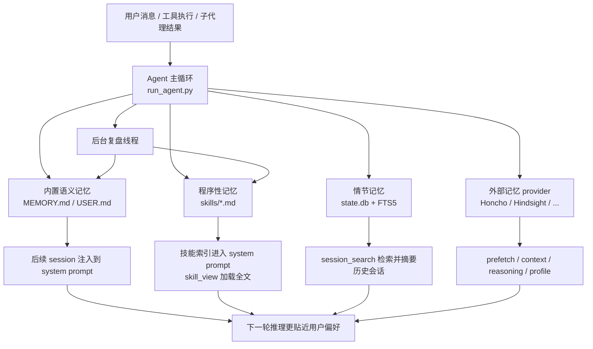

# Hermes Agent 自改进能力分析

## TL;DR

Hermes Agent 的“自改进”不是参数级学习，也不是在线微调；它实现的是**应用层闭环学习**。核心做法是把一次次对话、工具使用和执行经验，拆分沉淀为四种不同层次的“记忆”：

1. **语义记忆**：`MEMORY.md` / `USER.md` 中的持久化事实。
2. **程序性记忆**：`skills/` 目录中的 `SKILL.md`，即可复用工作流。
3. **情节记忆**：SQLite + FTS5 保存的历史会话，可跨 session 检索和摘要。
4. **外部反思型记忆**：通过 Honcho / Hindsight / Mem0 等 provider 做更深层的用户建模和检索。

它真正强的地方，不是“模型越聊越聪明”，而是**系统越来越知道用户是谁、以前做过什么、哪些做法有效、哪些技能需要修补**。

## 1. 它所说的“自改进”到底是什么

从代码看，这个项目的自改进主要是以下几件事的组合：

- **把稳定事实写入长期记忆**，减少用户重复纠正。
- **把可复用方法写成技能**，让以后类似任务直接复用。
- **把历史会话存档并可召回**，弥补单次上下文窗口的遗忘。
- **在外部 memory provider 中形成更深的用户表征**，而不只是保存碎片事实。
- **在复杂任务后做后台复盘**，尝试自动保存 memory 或 skill。

这和传统意义上的“模型训练”不同。Hermes Agent 不会在运行时更新权重；它更新的是：

- prompt 中会再次注入的上下文
- 持久化文件中的知识
- 历史会话索引
- 外部记忆系统中的用户/AI 表征

所以更准确地说，它是一个**带持久状态和复盘机制的 agent runtime**。

## 2. 闭环结构

这个闭环不是单一机制，而是多层记忆协作：

- **memory** 负责“长期稳定事实”
- **skills** 负责“可复用 procedure”
- **session_search** 负责“过去发生过什么”
- **provider** 负责“更强的用户建模 / 语义检索 / 反思”

## 3. 具体机制拆解

### 3.1 内置语义记忆：`MEMORY.md` + `USER.md`

核心实现：

- [`tools/memory_tool.py`](tools/memory_tool.py)
- [`run_agent.py`](run_agent.py)

#### 它保存什么

内置 memory 分成两个文件：

- `MEMORY.md`：环境事实、项目约定、工具坑点、经验教训
- `USER.md`：用户身份、偏好、沟通风格、行为期待

这两类信息分别对应 agent 自己的“工作笔记”和“用户画像”。

#### 它怎么写入

模型通过 `memory` 工具写入，支持：

- `add`
- `replace`
- `remove`

写入由 `MemoryStore` 负责，特点包括：

- 文件持久化，跨 session 保留
- 有字符预算上限，避免无限膨胀
- 去重
- 基于子串的 replace/remove
- 原子写入和文件锁，避免并发损坏
- 对注入 / 外带数据做扫描拦截

这说明它不是一个“原样记录日志”的 memory，而是**受预算约束的精选知识库**。

#### 它怎么进入未来对话

`run_agent.py` 在构建 system prompt 时，会把 memory 的**冻结快照**注入进去。关键点是：

- memory 文件会立刻落盘
- 但**当前 session 的 system prompt 不会随写入实时变化**
- 新写入通常要到**下一个 session** 才重新注入

这是个很重要的设计取舍：它优先保证 prompt caching 稳定和成本可控，而不是追求“写完立刻影响同一轮推理”。

#### 它怎么自动触发保存

Hermes 并不完全依赖模型“自觉记住”。

在 `run_agent.py` 里，存在两层自动触发：

1. **周期性 memory nudge**
   默认每 `10` 个用户 turn，触发一次后台复盘。
2. **上下文压缩 / 重置前 flush**
   在压缩、CLI 退出、gateway session reset 前，会额外给模型一个只带 `memory` 工具的保存机会。

也就是说，系统担心“有价值信息还没写入就丢上下文”，于是专门做了兜底。

#### 后台复盘是怎么做的

`run_agent.py` 里的 `_spawn_background_review()` 会起一个独立线程，再 fork 一个轻量 `AIAgent`：

- 继承当前对话快照
- 使用 review prompt
- 允许调用 `memory` / `skill_manage`
- 不打断主任务
- 成功后会给出简短的“Memory updated”类提示

这意味着 Hermes 的 memory 保存不是全靠主对话当场完成，而是允许**异步复盘补写**。

#### 评价

这一层是 Hermes 最扎实的“自改进”基础设施：简单、明确、可审计、成本可控。

但它的边界也很明显：

- 它依赖模型判断“什么值得记”
- 它不会在同一 session 中即时改变 system prompt
- 它是精选事实存储，不是全量长期知识图谱

### 3.2 程序性记忆：技能系统 `skills/`

核心实现：

- [`agent/prompt_builder.py`](agent/prompt_builder.py)
- [`tools/skills_tool.py`](tools/skills_tool.py)
- [`tools/skill_manager_tool.py`](tools/skill_manager_tool.py)
- [`agent/skill_commands.py`](agent/skill_commands.py)

如果说 memory 记录的是“事实”，那么 skills 记录的是“做事方法”。

#### 技能如何形成闭环

闭环是这样的：

1. 系统 prompt 先注入**技能索引**
2. 模型被要求先扫描技能列表
3. 发现相关技能时，必须调用 `skill_view`
4. 任务执行过程中如果发现技能过时或漏步骤，调用 `skill_manage(action='patch')`
5. 复杂任务后可创建新技能，供未来复用

这就是非常典型的**程序性记忆闭环**。

#### 技能为什么重要

技能目录本质上把 agent 的经验固化成了可版本化的 markdown：

- `SKILL.md` 是主说明
- `references/` 放补充材料
- `templates/` 放模板
- `scripts/` 放辅助脚本
- `assets/` 放资源文件

这比把 procedure 塞进 memory 更合适，因为复杂流程需要结构化说明。

#### “技能自改进”是否真的自动

有两层：

1. **prompt 级强约束**
   在 `build_skills_system_prompt()` 和 `skill_manage` 的 schema 里，模型被明确要求：
   - 复杂任务成功后考虑沉淀为 skill
   - 如果使用 skill 时发现错误，要立刻 patch

2. **后台 skill review**
   `run_agent.py` 里有 skill nudge 逻辑。默认每 `10` 次工具调用迭代，如果这一轮没有使用 `skill_manage`，任务完成后会触发后台复盘 agent，尝试创建或更新 skill。

所以答案是：**有自动化，但仍然是模型驱动的自动化，而不是纯规则引擎**。

#### 技能如何影响未来

技能索引会进入 system prompt，但技能全文不会全部塞进去。全文采用按需加载：

- 先 `skills_list` / system prompt 看到索引
- 再 `skill_view` 拉全文

这是一个很好的折中：

- 避免一开始把全部技能都塞爆上下文
- 又能在需要时精确加载

#### 技能层的强项

- 比 memory 更适合保存复杂 workflow
- 允许 patch，而不是整篇重写
- 本质是文件系统，可审阅、可版本管理
- 支持 supporting files，不局限于单一 markdown

#### 技能层的限制

- “创建前确认用户”目前主要写在 schema 描述里，**不是硬性技术门槛**
- 背景复盘 agent 依然可能自主创建 / 修改技能
- 是否沉淀为 skill，仍然取决于模型对“可复用性”的判断

也就是说，这一层很强，但自治程度是**软约束驱动**的，不是完全硬编码。

### 3.3 情节记忆：会话数据库 + `session_search`

核心实现：

- [`hermes_state.py`](hermes_state.py)
- [`tools/session_search_tool.py`](tools/session_search_tool.py)

这层解决的问题不是“用户偏好是什么”，而是：

- 我们以前讨论过什么？
- 上次怎么修过这个 bug？
- 之前在哪个 session 做过类似工作？

#### 它存什么

`hermes_state.py` 使用 SQLite 存：

- session 元信息
- message 全历史
- token / cost 等统计

并用 FTS5 建全文索引，支持跨会话搜索。

#### `session_search` 的工作流

`session_search_tool.py` 的流程很清楚：

1. FTS5 搜消息
2. 按 session 分组去重
3. 过滤当前会话 lineage
4. 加载候选 session transcript
5. 截取相关片段
6. 用辅助模型做 focused summary
7. 返回“过去那次会话发生了什么”

这不是 raw transcript 回放，而是**摘要化的 episodic recall**。

#### 为什么这层很关键

如果只有 memory 和 skills，会丢掉大量“只在某次任务里有用，但未来也许还要回想”的上下文。

例如：

- 某次调试中试过哪些失败方案
- 某个 issue 曾经在哪个文件修过
- 用户曾经提到但不值得写进永久 memory 的临时背景

这些信息不适合进 memory，也未必值得做成 skill，但很适合留在 session archive 里。

#### 设计上的优点

- 把“长期事实”与“历史情节”分开
- 不必把大量杂质写进 memory
- 需要时再用辅助模型摘要，主上下文保持干净
- 处理了 parent/child session lineage，避免把当前对话碎片重新搜回来

#### 限制

- 它依赖 SQLite transcript 完整性
- 检索质量依赖 query 写法和辅助模型摘要质量
- 它是“回忆过去发生了什么”，不是主动提炼稳定知识

所以 session_search 更像**情节记忆层**，而不是语义记忆层。

### 3.4 外部 memory provider：更强的用户建模和语义检索

核心实现：

- [`agent/memory_provider.py`](agent/memory_provider.py)
- [`agent/memory_manager.py`](agent/memory_manager.py)
- [`plugins/memory/`](plugins/memory/)

这是 Hermes “自改进能力”里最可扩展的一层。

#### 抽象接口

外部 provider 可以实现这些能力：

- `system_prompt_block()`
- `prefetch()`
- `queue_prefetch()`
- `sync_turn()`
- `get_tool_schemas()`
- `handle_tool_call()`
- `on_turn_start()`
- `on_session_end()`
- `on_pre_compress()`
- `on_memory_write()`
- `on_delegation()`

换句话说，provider 不只是一个“外部搜索工具”，而是能进入：

- 每 turn 的 recall
- 每 turn 的 write-back
- session 结束时的 flush
- 压缩前提炼
- delegation 完成后的观察

这说明 Hermes 把“自改进”抽象成了一套生命周期接口，而不仅是几个零散工具。

#### 只允许一个外部 provider

当前设计明确只允许**一个**外部 provider 激活。

优点：

- 避免 schema 膨胀
- 避免多个 memory backend 冲突
- 降低模型选择工具时的复杂度

缺点：

- 不能把“语义 recall”和“用户画像”分别交给不同 provider 同时跑

这是一个明显偏工程可控性的取舍。

#### Honcho：最接近“深层自我改进”的 provider

核心实现：

- [`plugins/memory/honcho/__init__.py`](plugins/memory/honcho/__init__.py)
- [`plugins/memory/honcho/session.py`](plugins/memory/honcho/session.py)

Honcho 不是简单的向量检索，它更像一个“跨 session 人物建模系统”。

它做的事情包括：

- 为 user 和 AI 各维护 peer
- 自动 prefetch 用户表征、peer card、session summary
- 通过 dialectic reasoning 做多轮反思式补充
- 支持 semantic search、profile、context、conclusion 等工具
- 可把内置 `USER.md` 的新增条目镜像成 Honcho conclusion

最重要的是它的两层注入：

1. **基础上下文层**
   representation / card / summary
2. **dialectic supplement**
   基于 turn cadence 的额外推理结果

这已经不是“记住几个事实”，而是在尝试持续形成一个更丰富的用户模型。

#### Hindsight：偏知识图谱式长期记忆

核心实现：

- [`plugins/memory/hindsight/__init__.py`](plugins/memory/hindsight/__init__.py)

Hindsight 的方向不同：

- 自动 retain 对话 turn
- recall / reflect 双模式
- 强调 knowledge graph、entity resolution、多策略检索

它更像“长期知识仓库”，而不是 Honcho 那种更人格化的 peer modeling。

#### 这一层的意义

Hermes 的内置 memory 很克制；真正更有野心的“深层自改进”都放在 provider 层。

这说明项目的设计哲学是：

- 内置层提供稳定可审计的基础闭环
- 更复杂、更昂贵、更实验性的记忆和建模能力，通过插件提供

这使它既能轻量运行，也能在需要时扩展到更强的用户建模。

### 3.5 Delegation 反馈：子代理成果也能被学习

核心实现：

- [`tools/delegate_tool.py`](tools/delegate_tool.py)

这里有个很关键但容易忽略的点：

- 子代理创建时是 `skip_memory=True`
- 并且 `memory` 工具被明确屏蔽

这说明 Hermes **不允许子代理直接写共享 memory**，避免污染主代理的长期状态。

但是，委派完成后，父代理会调用：

- `parent_agent._memory_manager.on_delegation(...)`

也就是说：

- 子代理本身不直接学习
- 但父代理的外部 provider 可以把“委派任务 + 结果”当作观察素材

这是非常好的边界控制：

- 防止子代理乱写 memory
- 又不丢掉子代理执行中产生的经验价值

不过要注意：这层主要影响**外部 provider**。内置 memory 是否吸收这些结果，还要靠后续主代理复盘或用户驱动保存。

### 3.6 上下文压缩前的学习补救

核心实现：

- [`run_agent.py`](run_agent.py)
- [`agent/context_compressor.py`](agent/context_compressor.py)

Hermes 明确知道一个事实：**上下文压缩会丢信息**。

所以它在压缩前会先做两件事：

1. 调用 `flush_memories()`，给模型一次额外保存 memory 的机会
2. 调用 memory provider 的 `on_pre_compress()`，让 provider 提取将被压缩掉的重要信息

这一步很关键，因为它把“压缩导致遗忘”的风险，转化成了“压缩前抽取 durable knowledge”。

也就是说，压缩不只是 token 管理，它也是闭环学习中的一个 checkpoint。

## 4. 这套自改进体系的真正强项

### 4.1 分层明确

Hermes 没把所有记忆都塞进一个桶里，而是分成：

- 事实
- procedure
- 情节
- 深层画像 / 外部语义记忆

这让每层都更清楚，也更容易控制膨胀。

### 4.2 成本意识很强

很多机制都明显是为了在可接受成本内运行：

- memory 是小而精的字符预算
- 技能索引先注入，全文按需加载
- session_search 先 FTS，再摘要
- Honcho 有 cadence、frequency、token budget
- 背景 review 异步执行，不抢主任务注意力

这不是“堆能力”，而是认真考虑了 agent 长时间运行的实际成本。

### 4.3 可审计、可编辑、可回滚

很多“学到的东西”都最终落在可见文件里：

- `memories/MEMORY.md`
- `memories/USER.md`
- `skills/**/SKILL.md`

这比黑盒向量库更容易让用户和开发者理解 agent 到底“学到了什么”。

### 4.4 对多平台和长生命周期友好

gateway、cron、delegation、compression、session reset 这些场景都被考虑到了。说明它不是只针对一次性 CLI 会话设计的，而是真正面向“常驻 agent”。

## 5. 它的边界和短板

### 5.1 它不是权重级学习

这是最重要的边界。

Hermes 的“自改进”不是：

- online finetuning
- RLHF
- LoRA 增量训练
- 参数更新

它是：

- prompt/context 更新
- 文件化知识积累
- 检索式回忆
- 外部系统建模

这很强，但要避免误解。

### 5.2 很多自动化仍然是 prompt-mediated

很多关键行为虽然“会自动发生”，但底层仍是模型被 prompt 驱动去做：

- 什么时候该记 memory
- 什么时候该建 skill
- skill 是否应该 patch
- 某次任务是否值得沉淀

这意味着：

- 行为具有弹性
- 也具有不确定性

它不是纯规则系统，所以自治质量仍受模型能力影响。

### 5.3 内置 memory 的即时性有限

由于 prompt cache 稳定性的考虑，当前 session 中新增的 memory 不会立刻回灌进 system prompt。

这带来两个结果：

- 对长期体验很好
- 对“同一 session 立刻用新记忆继续推理”帮助有限

### 5.4 注释和实现存在少量漂移

一个明显例子是：

- `agent/memory_manager.py`
- `agent/memory_provider.py`

它们的注释仍然把 built-in memory 描述成 provider 体系的一部分；但当前 `run_agent.py` 的真实接线方式是：

- 内置 memory：单独由 `MemoryStore` 管理
- 外部 provider：由 `MemoryManager` 管理

这不会直接破坏能力，但会影响开发者理解架构。

### 5.5 技能创建的“确认”不是硬约束

`skill_manage` 的 schema 描述说创建/删除 skill 前应该和用户确认，但目前这更像行为规范，而不是强制技术闸门。

因此在后台 review 或 flush 场景里，模型仍可能自主创建或修改 skill。

### 5.6 委派学习对内置 memory 较弱

子代理结果会回调给外部 provider 的 `on_delegation()`，但内置 memory 不会自动吸收这部分结果。要让它进入 `MEMORY.md` / `USER.md`，仍然更依赖主代理复盘或后续 turn 的显式保存。

## 6. 安全与约束：它并不是“无限自改写”

Hermes 在“让 agent 学东西”的同时，也做了很多约束。

### memory 安全

- `memory` 内容会做 prompt injection / exfiltration 扫描
- 有字符上限
- 去重和替换都有约束

### skill 安全

- `skill_view` 会对 skill 内容做注入模式检测
- 对 trusted skills directory 有判断
- `skill_manage` 阻止 path traversal
- `SKILL.md` frontmatter 结构会校验

### 子代理安全

- 子代理不能直接写 memory
- 子代理不能递归 delegation
- 子代理不能直接发送消息

整体上，这个项目不是让 agent “随便改自己”，而是在**给它受控的、可审计的自我更新通道**。

## 7. 代码层面的闭环总结

从实现层面看，Hermes 的自改进闭环可以概括成：

### 闭环 A：用户偏好学习

1. 用户在会话中表达偏好或纠正 agent
2. `memory` 工具或后台 review 将其写入 `USER.md` / `MEMORY.md`
3. 下一次 session 启动时注入到 system prompt
4. 后续行为更贴近该用户

### 闭环 B：工作流沉淀

1. 一次复杂任务中形成了非平凡方法
2. `skill_manage` 创建或 patch skill
3. 未来 system prompt 中出现该 skill 索引
4. 类似任务时先 `skill_view` 再执行
5. 使用中发现问题则继续 patch

### 闭环 C：历史情节回忆

1. 会话内容被写入 SQLite
2. 未来提到“上次怎么做的”
3. `session_search` 检索并摘要相关 session
4. 当前任务可重用过去经验，而无需写成永久 memory

### 闭环 D：深层用户建模

1. 外部 provider 同步对话 turn
2. prefetch / semantic recall / dialectic reasoning 形成 richer user model
3. 后续 turn 自动注入或工具检索
4. agent 对用户的理解逐渐从“事实列表”升级到“行为表征”

## 8. 最终判断

如果把“自改进”定义为“系统能否把经验转化为未来表现上的结构性优势”，那么 Hermes Agent 的答案是：**可以，而且做得相当系统**。

但它的自改进方式不是训练式，而是**记忆式、检索式、技能式和复盘式**。

我对它的判断是：

- **不是会自己训练自己的 agent**
- **是一个把长期记忆、程序性记忆和历史检索组合得很成熟的 agent runtime**
- **最强的价值在跨 session 累积和复用经验，而不是单次任务中的即时“变聪明”**

如果只看 marketing 文案，容易把它理解成“会自己升级模型”；如果看代码，真实结论更准确：

> Hermes Agent 的自改进，本质上是“把过去交互系统化沉淀为未来上下文优势”的工程体系。

## 9. 相关实现文件索引

- 主循环与触发逻辑：[`run_agent.py`](run_agent.py)
- 内置 memory：[`tools/memory_tool.py`](tools/memory_tool.py)
- 技能索引与注入：[`agent/prompt_builder.py`](agent/prompt_builder.py)
- 技能读取：[`tools/skills_tool.py`](tools/skills_tool.py)
- 技能修改：[`tools/skill_manager_tool.py`](tools/skill_manager_tool.py)
- 会话存储：[`hermes_state.py`](hermes_state.py)
- 历史检索：[`tools/session_search_tool.py`](tools/session_search_tool.py)
- 外部 provider 抽象：[`agent/memory_provider.py`](agent/memory_provider.py)
- provider 管理器：[`agent/memory_manager.py`](agent/memory_manager.py)
- Honcho provider：[`plugins/memory/honcho/__init__.py`](plugins/memory/honcho/__init__.py)
- Hindsight provider：[`plugins/memory/hindsight/__init__.py`](plugins/memory/hindsight/__init__.py)
- 子代理反馈：[`tools/delegate_tool.py`](tools/delegate_tool.py)
- memory 相关测试：[`tests/tools/test_memory_tool.py`](tests/tools/test_memory_tool.py)
- skill 相关测试：[`tests/tools/test_skill_manager_tool.py`](tests/tools/test_skill_manager_tool.py)
- session search 测试：[`tests/tools/test_session_search.py`](tests/tools/test_session_search.py)
