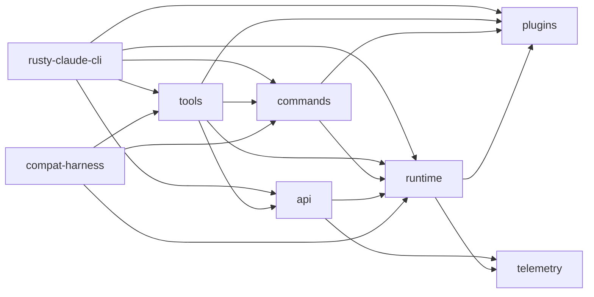

# 02. Rust Workspace 与 Crate 拆分

这一篇讲仓库的主实现为什么被拆成多个 crate，以及每个 crate 在整个系统中的位置。

## 1. Workspace 是整个主实现的骨架

`rust/Cargo.toml` 非常简洁：

- 使用 `members = ["crates/*"]`
- 所有核心模块都在 `rust/crates/`
- 统一使用 workspace 级别的版本、edition、license 和 lint

这说明作者的设计意图很明确：

- 不希望把所有实现都塞进一个 CLI crate
- 希望能力边界清晰
- 希望 API、runtime、tools、commands、plugins 等模块能独立演进

## 2. 当前 crate 列表

从各 crate 的 `Cargo.toml` 看，当前主要有 9 个 crate：

- `api`
- `commands`
- `compat-harness`
- `mock-anthropic-service`
- `plugins`
- `runtime`
- `rusty-claude-cli`
- `telemetry`
- `tools`

其中 `rusty-claude-cli` 是唯一的二进制入口，生成的命令名是 `claw`。

## 源码摘录：workspace 和主二进制是怎么声明的

下面两段就足够说明这个仓库的主实现结构。第一段摘自 `rust/Cargo.toml`，第二段摘自 `rust/crates/rusty-claude-cli/Cargo.toml`：

```toml
[workspace]
members = ["crates/*"]
resolver = "2"
```

```toml
[[bin]]
name = "claw"
path = "src/main.rs"

[dependencies]
api = { path = "../api" }
commands = { path = "../commands" }
compat-harness = { path = "../compat-harness" }
runtime = { path = "../runtime" }
plugins = { path = "../plugins" }
tools = { path = "../tools" }
```

从这个层面就能看出：

- `rusty-claude-cli` 只是入口壳
- 真正的能力来自 `runtime`、`tools`、`commands`、`api`、`plugins`
- `compat-harness` 也被入口显式依赖，说明 parity/兼容不是边缘功能

## 3. 每个 crate 的职责

### 3.1 `rusty-claude-cli`

这是顶层入口，负责：

- CLI 参数解析
- REPL 循环
- 文本 / Markdown 渲染
- 输出格式控制
- 把 `commands`、`runtime`、`tools`、`api` 组织成可运行的 CLI

可以把它理解为“组合层”，不是底层能力实现层。

### 3.2 `runtime`

这是系统内核，负责：

- 会话数据结构和持久化
- 对话主循环
- 配置发现与合并
- 权限策略和拦截
- sandbox 状态建模
- hooks
- MCP 生命周期
- usage / cost
- worker / task / team / cron 等运行时机制

如果只挑一个 crate 精读，优先级通常是 `runtime`。

### 3.3 `tools`

这个 crate 负责定义模型可调用的工具面：

- tool schema
- tool 权限级别
- 具体的执行分发
- tool search
- plugin tool / runtime tool 汇总

它相当于“模型可调用能力的注册中心 + 执行器”。

### 3.4 `commands`

这个 crate 负责 slash command 体系：

- 命令注册表
- 参数解析
- 帮助文本生成
- `/skills`、`/mcp`、`/plugin` 这些交互命令的本地处理

可以把它看作“面向人类输入的命令面”。

### 3.5 `api`

这个 crate 负责外部模型 provider 适配：

- Anthropic client
- OpenAI-compatible client
- 请求 / 响应类型
- SSE 解析
- OAuth 启动认证
- prompt cache

它是协议层，不直接做运行时 orchestration。

### 3.6 `plugins`

插件系统独立成 crate，负责：

- plugin manifest 解析
- plugin 注册和安装
- enable / disable / uninstall / update
- plugin hooks
- plugin tools 和 commands 暴露

这能避免 CLI 或 runtime 直接和具体插件目录结构强耦合。

### 3.7 `telemetry`

负责结构化遥测事件：

- analytics event
- session trace
- HTTP request 事件
- sink 接口

这为上层保留了“日志之外的结构化事件流”。

### 3.8 `mock-anthropic-service`

这是本地 deterministic mock provider，主要用于：

- 端到端测试
- parity harness
- 无真实网络依赖时的稳定验证

### 3.9 `compat-harness`

这个 crate 更偏迁移 / 对照用途，负责：

- 提取清单
- 对比能力面
- 帮助 parity 工作流

## 4. 依赖关系怎么理解

可以把 crate 关系粗略看成下面这样：



这里最重要的不是每条边的方向，而是分层方式：

- `rusty-claude-cli` 是顶层装配器
- `runtime` 是中枢
- `tools` / `commands` 是两套能力面
- `api` / `plugins` / `telemetry` 是支撑层
- `mock-anthropic-service` / `compat-harness` 是验证和迁移辅助层

## 5. 为什么 `commands` 和 `tools` 要分开

这是这个仓库设计里很值得注意的一点。

很多同类项目会把“给人用的命令”和“给模型用的工具”混在一起，但这里明显区分了两者：

- `commands` 处理 slash command，偏交互入口
- `tools` 处理 tool schema 和执行，偏模型能力面

这个拆分带来的好处是：

1. 人类命令的 UX 不会污染模型工具接口
2. tool 可以保持 schema 化和权限化
3. slash command 可以自由做帮助、规范化、别名和本地快速路径
4. 同一个能力可以同时有“人类入口”和“模型入口”

例如：

- `/skills` 是人类交互命令
- `Skill` 是模型工具

这两者有关联，但不是一回事。

## 6. 为什么 `runtime` 没有直接吞掉所有能力

同样值得注意的是，`runtime` 虽然是核心，但并没有把所有逻辑都吸进去。

这反映了一个比较健康的分层：

- `runtime` 关心状态和循环
- `tools` 关心能力注册和执行
- `commands` 关心人类命令面
- `api` 关心外部协议

如果把这些都塞进 `runtime`，虽然短期实现快，但后续会很难维护，也很难做测试和替换。

## 7. 建议的 crate 阅读顺序

如果准备读源码，我建议按下面顺序：

1. `rusty-claude-cli`
2. `runtime`
3. `tools`
4. `commands`
5. `api`
6. `plugins`
7. `telemetry`
8. `mock-anthropic-service`
9. `compat-harness`

原因是：

- 先知道入口在哪
- 再知道系统内核怎么运作
- 再理解能力接口
- 最后再去看扩展、协议和验证

## 8. 这一篇的结论

这一层最重要的结论是：

- 这个仓库不是一个单体 CLI 项目
- 它是一个分层明确的 Rust agent runtime
- `rusty-claude-cli + runtime + tools + commands` 共同构成主执行链
- `api + plugins + telemetry` 提供外围协议和扩展能力
- `mock-anthropic-service + compat-harness` 让迁移和 parity 可验证

下一篇开始看真正的入口：

- [03-cli-entry-and-command-dispatch.md](./03-cli-entry-and-command-dispatch.md)
