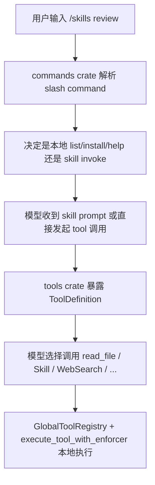

# 05. Tool、Skill、Slash Command 三套机制

这一篇讲仓库里最容易混淆的三套机制：

- slash command
- tool
- skill

它们彼此相关，但职责完全不同。

## 1. 先给一个结论

可以先记住这句话：

- slash command 是人类交互入口
- tool 是模型可调用能力
- skill 是本地可复用流程模板

理解这三者的分工，后面看命令和工具就不会混。

## 2. Slash Command：面向人类输入的控制面

`commands` crate 里维护了一组 `SlashCommandSpec`。每个命令都有：

- `name`
- `aliases`
- `summary`
- `argument_hint`
- 是否支持 resume

从源码可见，当前 slash command 面很大，至少包括：

- `/help`
- `/status`
- `/sandbox`
- `/config`
- `/mcp`
- `/session`
- `/plugin`
- `/agents`
- `/skills`
- `/doctor`
- `/review`
- `/tasks`

这些命令的职责主要是：

- 面向人类提供交互控制
- 展示帮助和当前状态
- 规范化参数
- 决定是本地处理还是转入后续流程

所以 slash command 更像“前台控制面板”。

## 3. Tool：面向模型调用的 schema 化能力

`tools` crate 里的 `ToolSpec` 定义了真正的工具接口。每个 tool 都显式包含：

- `name`
- `description`
- `input_schema`
- `required_permission`

这意味着工具调用在这里不是自由文本，而是：

- 有名字
- 有输入结构
- 有权限要求

这和 slash command 的差别很大，因为 slash command 更偏人类 UX，而 tool 更偏模型调用协议。

## 源码摘录：Tool 的声明长什么样

摘自 `rust/crates/tools/src/lib.rs`：

```rust
#[derive(Debug, Clone, PartialEq, Eq)]
pub struct ToolSpec {
    pub name: &'static str,
    pub description: &'static str,
    pub input_schema: Value,
    pub required_permission: PermissionMode,
}

#[derive(Debug, Clone)]
pub struct GlobalToolRegistry {
    plugin_tools: Vec<PluginTool>,
    runtime_tools: Vec<RuntimeToolDefinition>,
    enforcer: Option<PermissionEnforcer>,
}
```

这里已经把 tool 的两个关键事实写死了：

- 工具有 schema
- 工具有权限级别

## 4. 内置工具面长什么样

`mvp_tool_specs()` 中可以看到一长串工具。典型的几类如下：

### 4.1 文件和命令工具

- `bash`
- `read_file`
- `write_file`
- `edit_file`
- `glob_search`
- `grep_search`

### 4.2 网络和辅助工具

- `WebSearch`
- `WebFetch`
- `TodoWrite`
- `Skill`
- `ToolSearch`

### 4.3 扩展型工具

- `Agent`
- `LSP`
- `MCP`
- `ListMcpResources`
- `ReadMcpResource`

### 4.4 orchestration 工具

- `Task*`
- `Worker*`
- `Team*`
- `Cron*`

这已经说明：这个项目的工具面并不只针对“本地代码编辑”，而是在往更完整的 agent runtime 平台发展。

## 5. Tool 是怎么执行的

工具执行主入口在 `execute_tool_with_enforcer()`。

这个函数的工作方式很直接：

1. 根据 tool name 分支
2. 先做权限检查
3. 把 JSON 输入反序列化为具体类型
4. 调对应的 `run_*` 函数
5. 返回结构化 JSON 字符串

例如：

- `read_file` -> `run_read_file`
- `write_file` -> `run_write_file`
- `Skill` -> `run_skill`
- `WebSearch` -> `run_web_search`

这说明 tool 执行层其实很“朴素”：

- 上层负责把工具定义暴露给模型
- 下层负责把调用分发到具体实现

## 6. 权限是工具机制的一部分

每个 tool 都自带 `required_permission`，例如：

- `read_file` 是 `read-only`
- `write_file` 是 `workspace-write`
- `bash` 常常要求更高权限

然后 `GlobalToolRegistry` 会把这些要求汇总进 `PermissionPolicy`。真正执行时，如果当前模式不满足要求，就直接阻断。

这意味着：

- 工具权限不是靠 prompt 约束
- 而是运行时强制执行

这是 agent harness 和“随便写个函数让模型调用”之间的本质区别。

## 7. `GlobalToolRegistry`：统一工具注册中心

`GlobalToolRegistry` 是整个 tool 体系的关键。它负责汇总三类工具：

1. builtin tools
2. plugin tools
3. runtime tools

这三类工具最终都会被统一暴露成 `ToolDefinition` 给模型。

它还承担了几件重要工作：

- 检查命名冲突
- 处理 `--allowedTools`
- 暴露 permission specs
- 支持 tool search

所以它并不只是个列表，而是统一 control plane。

## 8. `--allowedTools`：工具面裁剪

CLI 支持 `--allowedTools` 参数。它会把用户输入规范化后，限制模型只能看到和调用允许的工具。

这里有两个层面的防护：

1. 发请求时只暴露允许的工具定义
2. 真正执行时再次检查是否在 allowlist 里

这保证了“没暴露的工具”和“被偷偷调用的工具”都不会通过。

## 源码摘录：工具白名单和别名规范化

同样摘自 `rust/crates/tools/src/lib.rs`：

```rust
for (alias, canonical) in [
    ("read", "read_file"),
    ("write", "write_file"),
    ("edit", "edit_file"),
    ("glob", "glob_search"),
    ("grep", "grep_search"),
] {
    name_map.insert(alias.to_string(), canonical.to_string());
}
```

这段虽然短，但很能说明问题：`--allowedTools read,glob` 这类 CLI 输入，最终会被规范化成真正的 tool 名称。

## 9. Skill：本地可复用提示词包

`Skill` 工具看起来像一个普通 tool，但它做的事和 `bash`、`read_file` 不一样。

`Skill` 的工作流程是：

1. 根据 skill 名称解析路径
2. 找到对应的 `SKILL.md`
3. 读取完整内容
4. 返回 `path`、`description`、`prompt` 等结构化信息

也就是说，skill 本身不是执行器，而是“把一段本地工作流说明读出来给模型”。

## 源码摘录：`/skills` 和 `Skill` 的关键实现

先看 `commands` crate 中 `/skills` 的分类逻辑，摘自 `rust/crates/commands/src/lib.rs`：

```rust
pub fn classify_skills_slash_command(args: Option<&str>) -> SkillSlashDispatch {
    match normalize_optional_args(args) {
        None | Some("list" | "help" | "-h" | "--help") => SkillSlashDispatch::Local,
        Some(args) if args == "install" || args.starts_with("install ") => {
            SkillSlashDispatch::Local
        }
        Some(args) => SkillSlashDispatch::Invoke(format!("${}", args.trim_start_matches('/'))),
    }
}
```

再看 `tools` crate 里 `Skill` 工具真正做的事，摘自 `rust/crates/tools/src/lib.rs`：

```rust
fn execute_skill(input: SkillInput) -> Result<SkillOutput, String> {
    let skill_path = resolve_skill_path(&input.skill)?;
    let prompt = std::fs::read_to_string(&skill_path).map_err(|error| error.to_string())?;
    let description = parse_skill_description(&prompt);

    Ok(SkillOutput {
        skill: input.skill,
        path: skill_path.display().to_string(),
        args: input.args,
        description,
        prompt,
    })
}
```

这两段放在一起看就很清楚：

- `/skills xxx` 先决定是本地处理还是转成 skill invoke
- `Skill` 工具负责把对应 `SKILL.md` 读回来

## 10. Skill 会去哪些地方找

从 `commands::resolve_skill_path()` 和 `tools` 中的兼容搜索逻辑看，skill 会从这些位置搜索：

- 项目内 `.claw/skills`
- 项目内 `.codex/skills`
- 项目内 `.claude/skills`
- 项目内 `.agents/skills`
- 用户级 `~/.claw/skills`
- 用户级 `~/.codex/skills`
- 用户级 `~/.claude/skills`
- `CODEX_HOME/skills`
- `CLAW_CONFIG_HOME/skills`
- 兼容旧布局的 `commands/` 目录

这个搜索策略说明 skill 体系是为“项目级 + 用户级复用”设计的。

## 11. `/skills` 命令和 `Skill` 工具的关系

这也是一个容易混淆的点。

### `/skills`

这是 slash command，面向人类。负责：

- `list`
- `install`
- `help`
- skill 名称解析和调用入口

### `Skill`

这是模型工具，面向模型。负责：

- 加载某个 skill 的内容
- 返回 prompt 和描述

所以两者关系是：

- `/skills` 提供交互入口
- `Skill` 提供运行时能力

不是谁替代谁，而是人类入口和模型能力的对应关系。

## 12. `classify_skills_slash_command()` 的设计很聪明

`commands` crate 中，`classify_skills_slash_command()` 会把不同输入区分成两类：

- 本地处理
- 调用 skill

像下面这些情况会本地处理：

- `/skills`
- `/skills list`
- `/skills help`
- `/skills install ...`

而真正的 skill 调用会被规范化成形如 `"$skill_name ..."` 的 prompt 入口。

这说明：

- slash command 层并不直接执行 skill
- 而是先把“用户意图”整理成更标准的调用形式

## 13. ToolSearch：给模型找工具的工具

这个项目里还有一个值得注意的设计：`ToolSearch`。

它并不是业务工具，而是 meta-tool，用来：

- 查询当前有哪些工具
- 按关键词筛选
- 包含 deferred tool / runtime tool / plugin tool

这类工具的存在说明作者已经在考虑“工具面足够大之后，模型怎么自己选工具”的问题。

## 14. 三者的关系图

可以把三者关系理解成：



## 15. 这一篇的结论

最重要的结论有四条：

1. slash command 是人类控制面，不等于模型工具。
2. tool 是 schema 化、权限化的运行时能力。
3. skill 是本地可复用提示词包，不是二进制插件。
4. `commands`、`tools`、`runtime` 三者分层清晰，是这个项目架构质量比较高的地方。

下一篇看扩展系统：

- [06-extension-systems-plugin-mcp-worker-task-cron.md](./06-extension-systems-plugin-mcp-worker-task-cron.md)
