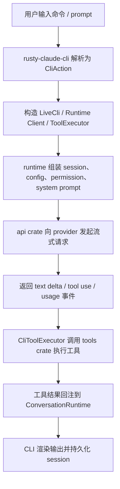

# Claw Code 源码解析总览

这组文档用于系统拆解当前仓库的 Rust 主实现。目标不是逐文件罗列，而是先建立整体心智模型，再按执行链路和模块边界逐章展开。

从仓库自述看，这个项目的主实现位于 `rust/`，顶层 `src/` 和 `tests/` 更偏向参考层、兼容层和审计辅助层。因此，这组文档默认把 `rust/` 作为主线。

## 文档目录

1. [01-repository-positioning.md](./01-repository-positioning.md)
   仓库定位、顶层目录、阅读入口、文档地图。
2. [02-rust-workspace-and-crates.md](./02-rust-workspace-and-crates.md)
   Rust workspace 的 crate 拆分、依赖关系和阅读顺序。
3. [03-cli-entry-and-command-dispatch.md](./03-cli-entry-and-command-dispatch.md)
   `claw` CLI 从参数解析到命令分发的入口链路。
4. [04-runtime-core.md](./04-runtime-core.md)
   会话、配置、权限、沙箱、对话主循环这些运行时核心。
5. [05-tools-skills-and-slash-commands.md](./05-tools-skills-and-slash-commands.md)
   Tool、Skill、Slash Command 三套机制如何分工和协作。
6. [06-extension-systems-plugin-mcp-worker-task-cron.md](./06-extension-systems-plugin-mcp-worker-task-cron.md)
   Plugin、MCP、Worker、Task、Team、Cron 等扩展系统。
7. [07-api-streaming-auth-and-telemetry.md](./07-api-streaming-auth-and-telemetry.md)
   Provider 接入、流式响应、OAuth、Prompt Cache、Telemetry。
8. [08-tests-parity-and-python-reference-layer.md](./08-tests-parity-and-python-reference-layer.md)
   Mock parity harness、验证方式，以及 Python 参考层的角色。
9. [09-context-management-and-compaction.md](./09-context-management-and-compaction.md)
   上下文注入、session transcript、prompt budget、自动/手动压缩、prompt cache。

## 推荐阅读顺序

第一次进入仓库，建议按下面顺序读：

1. 根目录 `README.md`
2. 根目录 `USAGE.md`
3. `rust/README.md`
4. 本目录的 `01` 和 `02`
5. `03`、`04`、`05`
6. `06`、`07`
7. `09`
8. `08`
9. 最后回头看根目录 `PARITY.md`、`ROADMAP.md`、`PHILOSOPHY.md`

这样做的原因很简单：先理解这个仓库想解决什么问题，再去看它怎么实现，而不是一开始就被大文件和细节拖进去。

## 这套源码解析回答的核心问题

这组文档试图回答 4 个问题：

1. 这个仓库到底是普通 CLI，还是 agent runtime？
2. Rust workspace 为什么拆成这些 crate？
3. 模型输出、工具调用、会话持久化之间是怎么串起来的？
4. 为什么这个项目会引入 Plugin、MCP、Worker、Task、Team、Cron、Parity Harness 这些看起来偏“平台化”的能力？

## 一张总图

可以把系统主链路先压缩成下面这张图：



这也是后面几篇文档的主线：

- `03` 负责讲 A 到 C
- `04` 负责讲 D 到 H 的运行时骨架
- `05` 负责讲具体工具和命令机制
- `07` 负责讲 E、F 的协议层
- `09` 负责讲 D、E、H 之间与“上下文尺寸”相关的管理和压缩策略

## 关键源码摘录

下面这段摘自 `rust/crates/rusty-claude-cli/src/main.rs`，基本就是整条主链路的起点。它说明这个 CLI 先把参数解析成 `CliAction`，再分发到不同执行路径，而不是把逻辑硬塞在一个 REPL 循环里：

```rust
fn main() {
    if let Err(error) = run() {
        let message = error.to_string();
        if message.contains("`claw --help`") {
            eprintln!("error: {message}");
        } else {
            eprintln!(
                "error: {message}

Run `claw --help` for usage."
            );
        }
        std::process::exit(1);
    }
}

fn run() -> Result<(), Box<dyn std::error::Error>> {
    let args: Vec<String> = env::args().skip(1).collect();
    match parse_args(&args)? {
        CliAction::Skills { args, output_format } =>
            LiveCli::print_skills(args.as_deref(), output_format)?,
        CliAction::Prompt { prompt, model, output_format, allowed_tools, permission_mode } =>
            LiveCli::new(model, true, allowed_tools, permission_mode)?
                .run_turn_with_output(&prompt, output_format)?,
        CliAction::Repl { model, allowed_tools, permission_mode } =>
            run_repl(model, allowed_tools, permission_mode)?,
        CliAction::Help { output_format } => print_help(output_format)?,
        _ => { /* 其他命令分支 */ }
    }
    Ok(())
}
```

## 先记住的三个事实

读源码之前，先记住三个事实：

1. 当前主实现是 Rust，不是顶层 Python。
2. 这个项目的重点不是“聊天壳”，而是“可执行任务的 agent harness”。
3. 很多看起来像边角能力的模块，例如 `permissions`、`sandbox`、`hooks`、`worker_boot`、`mcp_lifecycle_hardened`，实际上决定了这个系统是否能被自动化代理稳定使用。

## 一句话总结

如果只保留一句话，可以这样概括这个仓库：

> 它不是单纯把模型塞进命令行，而是在构建一个可扩展、可控、可恢复的 coding agent runtime，然后再在上面叠加 CLI、REPL、tool、plugin 和 orchestration 能力。
